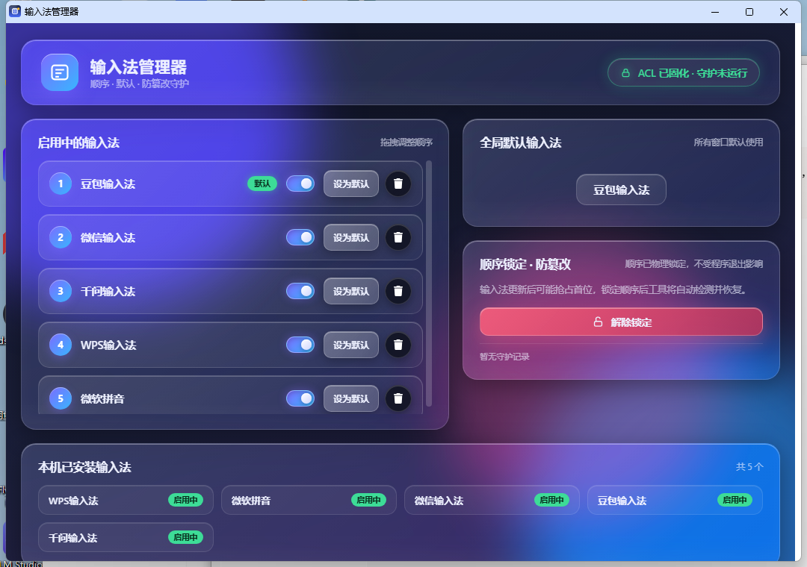

# 输入法管理器 ImeManager


> 自动检测本机全部输入法 · 拖拽排序 · 一键设为默认 · 顺序锁定防篡改（注册表 ACL 物理固化 + 后台守护兜底）

输入法更新后频繁抢占首位？第三方输入法偷偷改默认？**ImeManager** 是一个通用、免安装、单文件的 Windows 输入法顺序管理工具。它自动识别本机所有已安装输入法，支持拖拽排序、临时启停、设置全局默认，并可在锁定后**物理固化**注册表顺序——即使退出程序、输入法更新，也无法再打乱你的顺序。



## 目录

- [功能特性](#功能特性)
- [界面说明](#界面说明)
- [快速开始](#快速开始)
- [使用指南](#使用指南)
- [防篡改原理](#防篡改原理)
- [手动构建](#手动构建)
- [目录结构](#目录结构)
- [技术栈](#技术栈)
- [版本历史](#版本历史)
- [常见问题](#常见问题)
- [许可证](#许可证)

## 功能特性

- **自动检测**：扫描本机所有已安装输入法（简体中文过滤，自动识别描述名），不依赖硬编码列表，任何电脑即开即用
- **拖拽排序**：拖动已启用输入法调整切换顺序，实时写入注册表并重建 CTF 排序
- **全局默认**：一键把任意输入法设为系统默认输入法（`InputMethodOverride`）
- **临时启停**：不卸载程序，随时在启用 / 停用之间切换；停用项保留在列表变暗显示，可一键恢复
- **顺序锁定 · 防篡改**：
  - 注册表 ACL 物理固化（`Deny SetValue`），系统级拒绝第三方改写，**退出程序后依然生效**
  - 后台守护线程兜底，检测到顺序被改写后 5 秒内自动恢复
- **独立窗口**：使用独立的 Chrome 配置目录，与日常浏览器互不干扰（无插件、无书签污染）
- **静默驻留**：后台服务常驻内存约 40 MB，窗口关闭后仍守护顺序；二次双击秒开窗口
- **轻量免装**：打包后单文件约 25 MB，无需 Python、无需管理员权限、无需联网

## 界面说明

| 板块 | 作用 |
|------|------|
| 启用中的输入法 | 当前启用的输入法列表：拖动排序、开关启停、设为默认、删除 |
| 全局默认输入法 | 显示当前系统默认输入法，随设置实时更新 |
| 顺序锁定 · 防篡改 | 锁定 / 解锁顺序，显示 ACL 固化状态与守护记录 |
| 本机已安装输入法 | 扫描到的全部输入法，未启用的可一键启用 |

界面采用液态玻璃（Glassmorphism）风格，窗口支持等比缩放，启用项超过 6 个时列表自动启用滚动。

## 快速开始

### 方式一：直接运行（推荐）

1. 从 [Releases](https://github.com/imemanager/ImeManager/releases) 下载 `ImeManager.exe`
2. 双击运行，首次启动会自动打开管理窗口并驻留后台服务
3. 再次双击可秒开窗口（服务不重启）

> 无需安装 Python / 无需管理员权限 / 无需联网。仅支持 Windows 10/11。

### 方式二：源码运行

```bash
pip install -r requirements.txt
python main.py
```

源码模式需要本机安装 Python 3.11+ 与 Chrome（或 Edge）浏览器。

## 使用指南

1. **调整顺序**：在「启用中的输入法」直接拖动条目，松开即应用
2. **设为默认**：点击条目右侧「设为默认」，立即写入系统默认输入法
3. **停用 / 启用**：点击条目右侧开关；关闭后条目变暗并标记「已停用」，再次点击恢复
4. **锁定顺序**：点击「锁定」，注册表 ACL 即刻固化 + 守护线程启动
5. **解除锁定**：点击「解除锁定」，恢复自由修改（输入法更新、新增、卸载均不受限）
6. **启用已安装输入法**：在「本机已安装输入法」点击未启用项右侧 `+` 按钮

## 防篡改原理

Windows 未提供"锁定输入法顺序"的官方 API。ImeManager 采用双层防护：

| 层面 | 实现 |
|------|------|
| 顺序存储 | `HKCU\Control Panel\International\User Profile\<lang>` 下键值 `0804:{CLSID}{ProfileGUID}` 为顺序号 |
| 默认输入法 | 同键 `InputMethodOverride` |
| CTF 排序 | `HKCU\Software\Microsoft\CTF\SortOrder\AssemblyItem\0x00000804\{34745C63-...}` |
| 物理锁定 | 对上述注册表键写入 `Deny SetValue` ACL，系统级拒绝第三方写入 |
| 守护兜底 | watchdog 线程定时比对快照，检测到顺序被改写后 5 秒内自动恢复 |

> 解锁后用户可自由修改顺序、卸载或新增输入法。锁定仅保护"顺序"，不限制安装 / 卸载 / 更新。

## 手动构建

```bash
pip install pyinstaller
pyinstaller --noconfirm --clean --onefile --noconsole \
  --name ImeManager \
  --icon assets/icon.ico \
  --version version_info.txt \
  --add-data "web;web" \
  --add-data "acl_helper.ps1;." \
  --collect-all gevent --collect-all eel \
  --hidden-import bottle --hidden-import bottle_websocket --hidden-import pyparsing \
  main.py
```

产物位于 `dist/ImeManager.exe`。

## 目录结构

```
ime_manager/
├── main.py            # 入口：服务常驻 + 窗口管理（单入口一体模式）
├── ime_core.py        # 核心：注册表读写、输入法扫描、ACL 固化、watchdog
├── launcher.py        # 兼容启动器（脚本模式备用）
├── acl_helper.ps1     # PowerShell ACL 固化解锁辅助脚本
├── ImeManager.spec    # PyInstaller 构建配置
├── version_info.txt   # exe 版本信息（v0.1.0）
├── web/               # 前端（液态玻璃 UI）
│   ├── index.html
│   ├── style.css
│   ├── app.js
│   └── favicon.png
├── assets/            # 图标（icon.ico / icon.png）
├── docs/
│   └── screenshot.png # 主界面截图
├── README.md
├── LICENSE            # MIT
├── .gitignore
└── requirements.txt
```

## 技术栈

- Python 3.11 + [Eel](https://github.com/python-eel/Eel)（本地 Web 界面壳）
- gevent / bottle（内嵌 HTTP 服务）
- 原生 HTML/CSS/JS（液态玻璃风格，`backdrop-filter` 模糊 + 渐变光晕）
- PyInstaller 单文件打包（内置 Edge/Chrome 回退，跨环境免安装）

## 版本历史

### v0.1.0（2026-09-20）

首个开源版本：

- 自动检测本机全部已安装输入法（中文过滤）
- 拖拽排序、全局默认、临时启停（开关暗化反馈）
- 顺序锁定：注册表 ACL 物理固化 + watchdog 守护兜底
- 液态玻璃 UI，窗口等比缩放，列表超量滚动
- 独立 Chrome 配置目录，与日常浏览器隔离
- 单文件 exe 免安装交付（约 25 MB）

## 常见问题

**Q：锁定后还能卸载输入法吗？**
可以。锁定只保护"顺序"，不限制安装 / 卸载 / 更新；如需修改顺序或默认，先点"解除锁定"。

**Q：程序退出后锁定还有效吗？**
有效。ACL 固化写入注册表权限位，不依赖程序常驻；守护线程仅作为兜底。

**Q：窗口显示为浏览器样式？**
应用使用 Chrome App 模式（无地址栏），并隔离独立配置目录，与日常浏览器互不影响。

**Q：为什么我的输入法没有出现在列表？**
列表默认过滤非简体中文（0804）的输入法；如使用日文 / 韩文等输入法，暂不在展示范围。

**Q：会收集我的输入习惯吗？**
不会。所有数据仅写入本机注册表，无任何网络请求。

## 许可证

[MIT](LICENSE) © 2026 ImeManager

---

如果这个工具对你有帮助，欢迎 ⭐ Star，也欢迎提交 Issue 与 PR。
